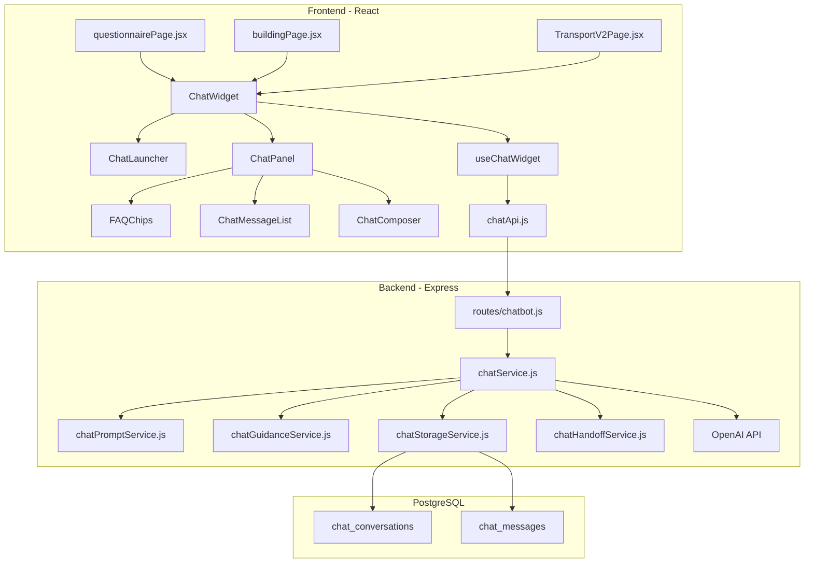

# Chatbot Widget MVP

## Architecture Overview




## 1. Database Schema

Append two tables to [server/init.sql](server/init.sql) at the end of the file (before the final blank lines):

```sql
CREATE TABLE IF NOT EXISTS chat_conversations (
    id SERIAL PRIMARY KEY,
    user_id INTEGER REFERENCES users(id) ON DELETE SET NULL,
    session_id VARCHAR(255),
    questionnaire_type VARCHAR(50) NOT NULL,
    certification_id INTEGER,
    building_id INTEGER,
    status VARCHAR(20) NOT NULL DEFAULT 'open',
    handoff_generated BOOLEAN NOT NULL DEFAULT FALSE,
    started_at TIMESTAMPTZ NOT NULL DEFAULT NOW(),
    last_message_at TIMESTAMPTZ NOT NULL DEFAULT NOW(),
    created_at TIMESTAMPTZ NOT NULL DEFAULT NOW(),
    updated_at TIMESTAMPTZ NOT NULL DEFAULT NOW(),
    CONSTRAINT chk_chat_status CHECK (status IN ('open', 'handed_off', 'closed'))
);

CREATE TABLE IF NOT EXISTS chat_messages (
    id SERIAL PRIMARY KEY,
    conversation_id INTEGER NOT NULL REFERENCES chat_conversations(id) ON DELETE CASCADE,
    role VARCHAR(20) NOT NULL,
    content TEXT NOT NULL,
    faq_key VARCHAR(100),
    model_name VARCHAR(100),
    token_usage JSONB,
    latency_ms INTEGER,
    created_at TIMESTAMPTZ NOT NULL DEFAULT NOW(),
    CONSTRAINT chk_message_role CHECK (role IN ('user', 'assistant', 'system'))
);

CREATE INDEX IF NOT EXISTS idx_chat_conversations_user ON chat_conversations(user_id);
CREATE INDEX IF NOT EXISTS idx_chat_conversations_session ON chat_conversations(session_id);
CREATE INDEX IF NOT EXISTS idx_chat_messages_conversation ON chat_messages(conversation_id);
```

No `chat_events` table for MVP -- the messages table captures enough metadata.

---

## 2. Backend Modules

All new files; only [server/server.js](server/server.js) and [server/package.json](server/package.json) are modified.

### 2a. Dependencies

Add `openai` to [server/package.json](server/package.json). Add `OPENAI_API_KEY` to [server/.env.example](server/.env.example).

### 2b. Route: `server/routes/chatbot.js`

Express Router mounted at `/api-v2` in server.js (same pattern as [server/routes/transportV2.js](server/routes/transportV2.js)). Three endpoints:

- **POST `/chatbot/conversations`** -- Create a new conversation. Accepts `{ questionnaireType, certificationId?, buildingId? }`. Returns `{ conversation }` with ID and greeting message.
- **POST `/chatbot/conversations/:id/messages`** -- Send a user message. Accepts `{ content, faqKey? }`. Calls OpenAI, persists both user and assistant messages, returns `{ message }`.
- **POST `/chatbot/conversations/:id/handoff`** -- Generate support email draft from conversation context. Returns `{ emailDraft: { to, subject, body } }`.

Auth: Use `authenticateJWT` from [server/middleware/auth.js](server/middleware/auth.js) as optional middleware -- extract `user_id` if present, fall back to `session_id` from cookies (the existing session cookie middleware in `server.js` already sets one).

### 2c. Service: `server/services/chatService.js`

Main orchestrator. Receives the request data, calls:

1. `chatStorageService` to persist user message
2. `chatPromptService` to build the system prompt for the questionnaire type
3. `chatGuidanceService` to retrieve approved guidance text
4. OpenAI chat completion (model: `gpt-4o-mini` for cost efficiency in MVP)
5. `chatStorageService` to persist assistant message
6. Returns the response

The service sends to OpenAI:

- System prompt (dynamic, includes guidance text inline)
- Last 10 messages from conversation history (kept short)
- Current user message

### 2d. Service: `server/services/chatPromptService.js`

Exports `getSystemPrompt(questionnaireType)`. Returns a structured system prompt string in Italian that includes:

- Role: helpful assistant for questionnaire compilation
- Behavioral rules: answer in Italian, be concise, never invent policy/legal claims, escalate when unsure
- Questionnaire-specific focus (transport vs buildings)

Two prompt templates hardcoded in this file:

- **Transport**: focused on vehicle data, fuel types, Euro standards, fleet info, CDC documents
- **Buildings**: focused on energy consumption, utility bills, APE documents, plants, refrigerant gases, building data

### 2e. Service: `server/services/chatGuidanceService.js`

Exports `getGuidanceText(questionnaireType)`. For MVP, returns a curated Italian text string per questionnaire type from files:

- `server/guidance/transport.txt`
- `server/guidance/buildings.txt`

These are plain text files with approved explanations. The guidance text is injected into the system prompt by `chatPromptService`. Initially these can contain placeholder content that the team fills in over time.

### 2f. Service: `server/services/chatStorageService.js`

Pure PostgreSQL operations using the shared pool from [server/db.js](server/db.js):

- `createConversation({ userId, sessionId, questionnaireType, certificationId, buildingId })`
- `getConversation(id)`
- `addMessage({ conversationId, role, content, faqKey, modelName, tokenUsage, latencyMs })`
- `getRecentMessages(conversationId, limit)` -- returns last N messages for context window
- `updateConversationStatus(id, status)`
- `markHandoffGenerated(id)`

### 2g. Service: `server/services/chatHandoffService.js`

Exports `generateEmailDraft(conversation, messages)`. Calls OpenAI with a dedicated prompt that:

- Summarizes the conversation into a support email
- Outputs in Italian with a clear subject, bullet list of issues, questionnaire type, relevant section/field
- Returns `{ to: "supporto@greenvisa.it", subject, body }`

### 2h. Route Registration in `server/server.js`

Add 3 lines next to the existing modular route registrations at ~line 4430:

```javascript
const chatbotRouter = require('./routes/chatbot');
app.use('/api-v2', chatbotRouter);
```

---

## 3. Frontend Modules

All new files live in `client/src/chatbot/`. Only three existing files are modified (one import + one JSX line each).

### 3a. API: `client/src/chatbot/chatApi.js`

Thin wrapper using `axiosInstance` from [client/src/axiosInstance.js](client/src/axiosInstance.js) (to reuse auth interceptor). Functions:

- `createConversation({ questionnaireType, certificationId, buildingId })`
- `sendMessage(conversationId, { content, faqKey })`
- `requestHandoff(conversationId)`

Note: `axiosInstance` base URL is `${VITE_REACT_SERVER_ADDRESS}/api`. The chatbot backend routes are under `/api-v2/chatbot/...`. To handle this, `chatApi.js` will create its own axios instance with base `${VITE_REACT_SERVER_ADDRESS}/api-v2`, replicating the auth interceptor. This mirrors how the codebase already has mixed `/api` and `/api-v2` usage.

### 3b. Hook: `client/src/chatbot/useChatWidget.js`

Manages all widget state:

- `isOpen` / `isMinimized` -- widget visibility
- `messages[]` -- chat history (preserved while page is open)
- `conversationId` -- created on first open, reused for the session
- `isLoading` / `error` -- request states
- `showHandoff` -- whether to show the email draft CTA
- `emailDraft` -- the generated draft

Exposes: `open()`, `close()`, `minimize()`, `sendMessage(text, faqKey?)`, `requestHandoff()`, `dismissError()`

### 3c. Components

All styled with Tailwind (matching existing codebase conventions). Brand green: `#2d7044`.


| Component             | Responsibility                                                                                                                                                                       |
| --------------------- | ------------------------------------------------------------------------------------------------------------------------------------------------------------------------------------ |
| `ChatWidget.jsx`      | Top-level wrapper. Receives `questionnaireType`, optional `certificationId`/`buildingId`. Renders either `ChatLauncher` or `ChatPanel`. Uses `useChatWidget` hook.                   |
| `ChatLauncher.jsx`    | Fixed `bottom-6 right-6 z-50` circular button with "?" icon + "AIUTO" label. `onClick` opens the panel.                                                                              |
| `ChatPanel.jsx`       | Fixed `bottom-6 right-6 z-50` panel (w-96, max-h-[32rem]). Header with title + minimize/close buttons. Body contains `ChatMessageList` + `FAQChips`. Footer contains `ChatComposer`. |
| `ChatMessageList.jsx` | Scrollable message list. Each message shows role (user right-aligned, assistant left-aligned) and content. Includes handoff CTA button when triggered.                               |
| `FAQChips.jsx`        | 3-5 clickable pill buttons below the greeting. Chips are contextual per `questionnaireType`. Clicking sends the FAQ text as a message.                                               |
| `ChatComposer.jsx`    | Text input + send button. Disabled during loading. Enter to send, Shift+Enter for newline.                                                                                           |


### 3d. FAQ Chips Content (Italian)

**Transport:**

- "Dove trovo il numero di targa?"
- "Cosa significa classe Euro?"
- "Quali documenti servono per i veicoli?"
- "Come inserisco i dati del carburante?"

**Buildings:**

- "Dove trovo i dati dei consumi energetici?"
- "Cos'e un attestato APE?"
- "Quali informazioni servono sugli impianti?"
- "Come inserisco i dati delle bollette?"

### 3e. Handoff Flow

When the assistant cannot answer from the approved guidance, the system prompt instructs it to ask the user whether they want a support email draft:

1. The message content shows the fallback text asking if the user wants an email draft
2. Below the message, render two buttons: "Si, scrivi email" / "No, continua"
3. If "Si": call `requestHandoff()`, which hits the backend endpoint and renders the email draft in a styled card with To/Subject/Body fields and a "Copia" (copy-to-clipboard) button
4. If "No": dismiss and continue chatting

### 3g. Integration into Pages

Three pages get the widget:

**[client/src/questionnairePage.jsx](client/src/questionnairePage.jsx)** -- Add `<ChatWidget>` inside the fragment, after `<Footer />`:

```jsx
import ChatWidget from './chatbot/ChatWidget';

// Inside the return, derive type from param2:
const questionnaireType = category === "Certificazione trasporti" ? "transport" : "buildings";
// ...
<ChatWidget questionnaireType={questionnaireType} certificationId={param1} />
```

**[client/src/buildingPage.jsx](client/src/buildingPage.jsx)** -- Add `<ChatWidget questionnaireType="buildings" buildingId={buildingID} />` at the end of the component (uses `buildingID` from `useRecoveryContext()`).

**[client/src/transportV2/TransportV2Page.jsx](client/src/transportV2/TransportV2Page.jsx)** -- Add `<ChatWidget questionnaireType="transport" certificationId={certificationId} />`.

Each integration is exactly 2 lines: one import, one JSX element.

---

## 4. Accessibility

- All interactive elements get `role`, `aria-label`, and `tabIndex`
- Launcher: `aria-label="Apri assistente"`, keyboard focusable
- Panel: focus trap when open, `Escape` key closes
- Composer: standard `<textarea>` with label
- Visible focus rings (existing global styles in `index.html` already set `outline` on `:focus-visible`)

---

## 5. Key Design Decisions

- **No form mutation**: The chatbot never writes to questionnaire state. It only reads `questionnaireType` and optional IDs.
- **Minimal context**: Only `questionnaireType`, `userMessage`, last 10 turns, and optional `faqKey` go to OpenAI. No DOM dumps, no form state.
- **Guidance as text files**: `server/guidance/transport.txt` and `buildings.txt` are plain Italian text files. Easy for the team to update without code changes.
- **Session-based conversations**: If the user is logged in, `user_id` is stored. If not, the existing `sessionId` cookie is used. Conversations persist across minimizes but not across page navigations (MVP scope).
- **gpt-4o-mini**: Cost-efficient, fast, sufficient for guidance Q&A in Italian.

---

## 6. Files Summary

### New files (15):

- `server/routes/chatbot.js`
- `server/services/chatService.js`
- `server/services/chatPromptService.js`
- `server/services/chatGuidanceService.js`
- `server/services/chatStorageService.js`
- `server/services/chatHandoffService.js`
- `server/guidance/transport.txt`
- `server/guidance/buildings.txt`
- `client/src/chatbot/ChatWidget.jsx`
- `client/src/chatbot/ChatLauncher.jsx`
- `client/src/chatbot/ChatPanel.jsx`
- `client/src/chatbot/ChatMessageList.jsx`
- `client/src/chatbot/ChatComposer.jsx`
- `client/src/chatbot/FAQChips.jsx`
- `client/src/chatbot/useChatWidget.js`
- `client/src/chatbot/chatApi.js`

### Modified files (6):

- `server/server.js` -- 2 lines: require + app.use
- `server/init.sql` -- append chatbot tables
- `server/package.json` -- add `openai` dependency
- `server/.env.example` -- add `OPENAI_API_KEY`
- `client/src/questionnairePage.jsx` -- 2 lines: import + JSX
- `client/src/buildingPage.jsx` -- 2 lines: import + JSX
- `client/src/transportV2/TransportV2Page.jsx` -- 2 lines: import + JSX

---

## 7. Manual Test Checklist

1. Open `/questionario/...?param2=Certificazione trasporti` -- launcher visible bottom-right
2. Click "AIUTO" -- panel opens with Italian greeting and transport FAQ chips
3. Click an FAQ chip -- sends as message, gets Italian response
4. Type a custom question -- gets a response
5. Ask something outside guidance scope -- gets fallback response and handoff CTA
6. Click "Si, scrivi email" -- email draft renders with To/Subject/Body and Copy button
7. Minimize panel -- launcher reappears; reopen -- conversation preserved
8. Open `/building/:id` -- launcher visible, FAQ chips are buildings-specific
9. Verify `chat_conversations` and `chat_messages` rows in PostgreSQL
10. Verify existing questionnaire flows still work unchanged

