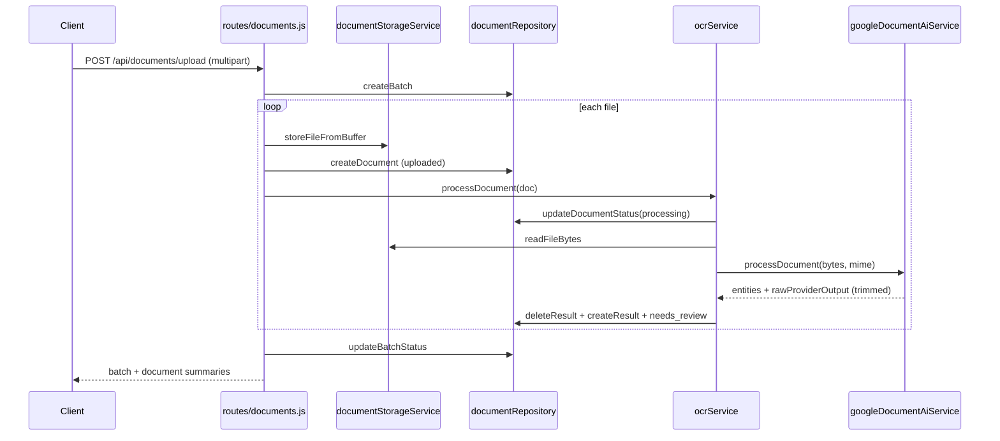

# OCR flow — technical report (implementation-based)

This document describes the **current** OCR document pipeline in the GreenVisa repository as implemented in backend and client code, with emphasis on persistence and stored JSON shapes. Facts are **verified** from the cited files unless explicitly labeled **inference**.

---

## 1. Executive summary

- **Upload entry point:** `POST /api/documents/upload` (also mounted under `/api-v2`). **Verified:** `server/server.js` mounts `server/routes/documents.js` on both prefixes; Transport V2 client uses `/api` + `/documents/upload`. **Verified:** `client/src/features/transportV2/api/transportV2Api.js`.
- **Execution model:** **Synchronous** within the HTTP request: after each accepted file is written to disk, `ocrService.processDocument` runs to completion before the response is sent. **Verified:** `server/routes/documents.js` (loop `await ocrService.processDocument(doc)`).
- **Provider:** Google Cloud Document AI via `@google-cloud/documentai`, `processDocument` RPC. **Verified:** `server/services/ocr/googleDocumentAiService.js`. Timeout uses `withTimeout` and `OcrProviderTimeoutError`. **Verified:** same file + `server/utils/withTimeout` (import).
- **Raw provider payload persistence:** **Not** the full API response. Only `{ document: { text, entities } }` is stored in `document_results.raw_provider_output`. Pages, layout, tokens, etc. are **dropped before INSERT**. **Verified:** `buildRawProviderOutputForPersistence` in `server/services/ocr/googleDocumentAiService.js` (comment at lines 122–125 matches behavior).
- **Domain coupling:** Normalization, review payload, derived output, and apply path are **Transport V2–centric** (vehicle fields, `transport_v2_vehicle_prefill`, merge into `survey_responses.survey_data.transport_v2`). **Verified:** `fieldMapper.js`, `transportV2OcrPrefillService.js`, `transportV2DraftService.js`, `surveyResponsesRepository.js`.
- **Reuse for APE:** The **relational shell** (`document_batches`, `documents`, `document_results`, status lifecycle, file storage pattern) is largely reusable if `category` (or similar) discriminates flows. **JSON column semantics** today assume Transport shapes; an APE flow would need **new mapping, review schema, apply target**, and likely **category-gated** apply logic. **Inference:** based on code structure; no APE implementation exists in repo at time of writing.

---

## 2. End-to-end sequence of the OCR flow

High-level sequence (**verified** from `server/routes/documents.js`, `server/services/ocr/ocrService.js`, `server/services/documents/documentRepository.js`):

1. **Authenticate** JWT (`authenticateJWT`).
2. **Parse multipart upload:** field name `files` (array), optional `buildingId`, `category` (default `transport`), optional `certificationId`. **Verified:** `documents.js` lines 49–52, multer `.array('files', …)`.
3. **Transport link (conditional):** If `category === 'transport'` and `certificationId` present, resolve `survey_response_id` via `resolveTransportSurveyResponse` (locks/creates `survey_responses` row). **Verified:** `documents.js` 61–67, `transportV2DraftService.js` `resolveTransportSurveyResponse`.
4. **Create batch:** `document_batches` row with `status = 'processing'`. **Verified:** `documentRepository.createBatch`.
5. **Per file:**
   - Validate (extension, MIME, size, magic bytes, duplicate hash in batch). **Verified:** `documentValidationService.js`.
   - On failure: insert `documents` with `ocr_status = 'failed'`, empty `storage_path` / `stored_name`, set error columns. **Verified:** `documents.js` 95–114.
   - On success: write file under `server/uploaded_documents/` (config), insert `documents` with `ocr_status = 'uploaded'`, then call `ocrService.processDocument(doc)`.
6. **`processDocument`:** `processing` → read bytes → Google Document AI → map → normalize → validate → build review + prefill → **replace** `document_results` row → `needs_review` (or `failed` on error). **Verified:** `ocrService.js`, `documentRepository.deleteResultByDocumentId` + `createResult`, `updateDocumentStatus`.
7. **Response:** JSON with `batchId`, `batchStatus`, `documents[]` summaries including `fields` / `validationIssues` / `error` per file. **Verified:** `documents.js` 189–196.
8. **Later (optional):** `GET …/result`, `POST …/confirm`, `POST …/apply`, `POST …/retry`. **Verified:** `documents.js`.



---

## 3. HTTP/API layer

| Method | Path | Auth | Purpose |
|--------|------|------|---------|
| POST | `/documents/upload` | JWT | Upload 1–N files, run OCR per file, return batch summary |
| GET | `/documents/user` | JWT | List current user’s documents |
| GET | `/document-batches/:batchId` | JWT | Batch + documents metadata |
| GET | `/documents/:documentId` | JWT | Single document metadata |
| GET | `/documents/:documentId/result` | JWT | OCR result JSON (review, normalized, etc.) |
| POST | `/documents/:documentId/confirm` | JWT | User-confirmed field array → `confirmed_output`, status `confirmed` |
| POST | `/documents/:documentId/apply` | JWT | Merge OCR prefill into Transport V2 draft, status `applied` |
| POST | `/documents/:documentId/retry` | JWT | Re-run OCR for `failed` docs with stored file |

**Mounting:** **Verified:** `server/server.js` ~5506–5508: `app.use('/api-v2', documentsRouter)` and `app.use('/api', documentsRouter)`.

### Upload request format

- **Content-Type:** `multipart/form-data`.
- **Files:** field name **`files`** (multiple). Max count and size from `server/config/ocr.js` (`maxFilesPerBatch: 20`, `maxFileSizeBytes: 10MB`). **Verified:** `documents.js` multer config.
- **Fields:** `buildingId` (optional int string), `category` (optional, default `transport`), `certificationId` (optional; used when `category === 'transport'`). **Verified:** `documents.js` 50–52, 61–67.

### Upload response shape (verified from handler)

```json
{
  "batchId": 1,
  "batchStatus": "needs_review",
  "fileCount": 1,
  "documents": [
    {
      "documentId": 10,
      "fileName": "coc.pdf",
      "status": "needs_review",
      "fields": [ "..." ],
      "validationIssues": [ "..." ],
      "error": null
    }
  ]
}
```

### Result endpoint response (verified: `documents.js` 325–338)

Returns: `reviewPayload`, `normalizedOutput`, `derivedOutput`, `transportV2VehiclePrefill` (resolved from confirmed → normalized), `validationIssues`, `confirmedOutput`, plus document metadata fields.

### Client contract (Transport V2)

**Verified:** `transportV2Api.js` uses `/documents/upload`, `GET /documents/:id/result`, `POST /documents/:id/apply`. **There is no client call to `POST …/confirm` in this feature** — **inference:** the live UI flow can apply directly from `needs_review` using normalized output (server allows it; see §9).

---

## 4. Provider integration layer

### Which provider

- **Library:** `@google-cloud/documentai` (`DocumentProcessorServiceClient`). **Verified:** `googleDocumentAiService.js` `getClient()`.
- **RPC:** `client.processDocument(request)`. **Verified:** same file.

### Where implemented

- **`server/services/ocr/googleDocumentAiService.js`** — client construction, processor name, request body, timeout, response shaping.
- **`server/services/ocr/ocrService.js`** — orchestration (read file, call provider, map, persist).

### Request shape sent to Google

**Verified** (`googleDocumentAiService.js` 97–103):

```json
{
  "name": "projects/{projectId}/locations/{location}/processors/{processorId}[/processorVersions/{processorVersion}]",
  "rawDocument": {
    "content": "<base64 string>",
    "mimeType": "<from uploaded file>"
  }
}
```

### Configuration / environment variables

| Variable / config key | Role | Default / notes |
|----------------------|------|-----------------|
| `GOOGLE_CLOUD_PROJECT_ID` | `ocrConfig.google.projectId` | `''` — required for real calls |
| `GOOGLE_DOCUMENT_AI_LOCATION` | API endpoint + region segment | `eu` |
| `GOOGLE_DOCUMENT_AI_PROCESSOR_ID` | Processor id | `''` — required |
| `GOOGLE_DOCUMENT_AI_PROCESSOR_VERSION` | Optional version suffix | `''` → omitted from name |
| `OCR_PROVIDER_TIMEOUT_MS` | Wall-clock timeout for RPC | `45000` (0 allowed but “not recommended” in comment) |
| `OCR_PROVIDER` | Stored on `documents.ocr_provider` | `google-document-ai` |

**Verified:** `server/config/ocr.js`, `documents.js` when creating rows.

**Note:** `ocrService.js` **always** imports and calls `googleDocumentAiService`; there is **no** runtime switch on `ocrConfig.provider`. **Verified:** grep + `ocrService.js`. **Inference:** `OCR_PROVIDER` is metadata unless extended.

### Error handling

- **Timeout:** `withTimeout` rejects with `OcrProviderTimeoutError` (`code: OCR_PROVIDER_TIMEOUT`, `retryable: true`). Logged as `ocr_provider_timeout`. **Verified:** `ocrProviderErrors.js`, `ocrService.js` 81–90.
- **Other errors:** Logged `ocr_processing_failed`; document set `ocr_status = 'failed'`, `ocr_error_code` / `ocr_error_message` from error. **Verified:** `ocrService.js` 91–107, `documentRepository.updateDocumentStatus`.
- **Missing npm package:** `getClient()` throws if `@google-cloud/documentai` not installed. **Verified:** `googleDocumentAiService.js` 16–20.

### What is kept vs discarded from the provider response

- **In-memory after RPC:** `extractEntitiesFromResponse` builds a list `{ type, mentionText, confidence, normalizedValue, pageNumber, boundingPoly }` for mapping. **Verified:** `googleDocumentAiService.js` 138–151.
- **Persisted `raw_provider_output`:** only `document.text` and `document.entities` (Google’s entity objects, not the slimmed list). **Verified:** `buildRawProviderOutputForPersistence` — explicitly drops pages/layout/tokens.

**Why partial raw storage:** Code comment states intent: avoid bloating DB with layout/page payloads while retaining full text + entities for audit/reprocessing. **Verified:** comment in `googleDocumentAiService.js` 122–125.

---

## 5. Mapping and normalization layer

### Files / functions

| Stage | File | Function / export |
|-------|------|---------------------|
| Provider → review-shaped fields | `server/services/ocr/fieldMapper.js` | `normalizeProviderOutput` |
| Coercion + per-field validation issues + warnings | `server/services/ocr/ocrOutputValidator.js` | `applyNormalizations`, `validateNormalizedOutput`, `buildFieldWarnings`, `injectDerivedGoodsVehicleReviewField` |
| Transport prefill row | `server/services/transportV2/transportV2OcrPrefillService.js` | `buildTransportV2VehiclePrefill` |

### Pipeline (step by step, verified `ocrService.js`)

1. **`normalizeProviderOutput(providerResult)`** — Uses `providerResult.entities` (slim list). Produces `fields[]` with keys from `FIELD_DEFINITIONS` (`registration_year`, `euro_class`, `fuel_type`, `max_vehicle_mass_kg`, `co2_emissions_g_km`, `vehicle_use_text`). Each: `key`, `label`, `value`, `confidence`, `required`, `sourceMethod` (`EXTRACT` / `NOT_FOUND`), `sourcePage`, `boundingPoly`. Unknown Google `type` values are **ignored** for this array (may still exist in `raw_provider_output`). **Verified:** `fieldMapper.js` comments + implementation.
2. **`applyNormalizations(rawFields)`** — Adds `normalizedValue`, `warnings[]` per field using domain rules (Euro class, fuel, mass, CO2, etc.). **Verified:** `ocrOutputValidator.js`.
3. **`injectDerivedGoodsVehicleReviewField(...)`** — If no `goods_vehicle_over_3_5_tons` field and `max_vehicle_mass_kg` normalizes to positive integer, appends synthetic boolean field with `sourceMethod: 'DERIVED_FROM_MASS'`. **Verified:** `ocrOutputValidator.js` 402–437.
4. **`validateNormalizedOutput(normalizedFields)`** — Produces `validationIssues[]` (`fieldKey`, `type`, `message`). Low confidence threshold `ocrConfig.confidence.lowThreshold` (0.8). **Verified:** `ocrOutputValidator.js` `validateNormalizedOutput`.
5. **`buildTransportV2VehiclePrefill`** — Builds `transport_v2_vehicle_prefill` object (vehicle id, transport_mode, `ocr_document_id`, `fields`, `field_sources`, `field_warnings`). **Verified:** `transportV2OcrPrefillService.js`.
6. **`buildDerivedOutput`** — Currently `{ transport_v2_vehicle_prefill: … }` (wrapper). **Verified:** `ocrService.js` 111–114.

### Boundaries (conceptual)

| Layer | Representation | Storage location |
|-------|----------------|------------------|
| Raw provider (trimmed) | `{ document: { text, entities } }` | `document_results.raw_provider_output` |
| Normalized provider-agnostic **review fields** | `fields[]` + normalized values/warnings | Inside `normalized_output`, `review_payload`, and after confirm `confirmed_output.fields` |
| Derived (review + prefill) | Synthetic boolean field; `transport_mode` from `vehicle_use_text` | `review_payload`, prefill object |
| Review payload | `fields`, `validationIssues`, `transport_v2_vehicle_prefill`, `derivedSummary` | `document_results.review_payload` |
| Confirmed | Same shape re-validated from user POST | `document_results.confirmed_output` |
| Applied | Not a separate JSON column — **document** `ocr_status` + **survey** JSON updated | `documents.ocr_status`, `survey_responses.survey_data.transport_v2` |

### Internal field structure after normalization (reconstructed from implementation)

Each element of `fields` (after step 2–3) includes at minimum:

```json
{
  "key": "euro_class",
  "label": "Classe Euro",
  "value": "Euro 6",
  "normalizedValue": "EURO_6",
  "confidence": 0.9123,
  "required": false,
  "sourceMethod": "EXTRACT",
  "sourcePage": 1,
  "boundingPoly": null,
  "warnings": []
}
```

**Reconstructed from:** `fieldMapper.js` + `applyNormalizations` + optional synthetic field in `injectDerivedGoodsVehicleReviewField`.

### Validation issues

- **Generation:** `validateNormalizedOutput` in `ocrOutputValidator.js` (low confidence, invalid year, unrecognized euro/fuel, mass/CO2 format, etc.). **Verified.**
- **Storage:** (1) JSONB column `document_results.validation_issues`, (2) duplicated inside `review_payload.validationIssues`, (3) on confirm, inside `confirmed_output.validationIssues`. **Verified:** `ocrService.js` `createResult` args; `documents.js` confirm handler.

### Review payload for frontend

Built in `ocrService.js` as:

```js
{
  fields: normalizedFields,
  validationIssues,
  transport_v2_vehicle_prefill: transportV2VehiclePrefill,
  derivedSummary: derivedOutput,
}
```

**Verified:** `ocrService.js` 53–58. Exposed via `GET …/result` as `reviewPayload`. **Verified:** `documents.js`.

---

## 6. Persistence layer

### File storage

| Aspect | Detail |
|--------|--------|
| Directory | `path.join(__dirname, '..', 'uploaded_documents')` relative to `server/config/ocr.js` → **`server/uploaded_documents/`** |
| Filename | `{timestamp}_{uuid}{ext}` | **Verified:** `documentStorageService.js` |
| DB reference | `documents.storage_path` (absolute path string), `stored_name` | **Verified:** `documentRepository.createDocument` |
| Failed validation | `storage_path` and `stored_name` **empty** | **Verified:** `documents.js` 100–101 |

### Database tables

#### `document_batches`

| Aspect | Detail |
|--------|--------|
| Purpose | Groups one upload request; aggregates status from child documents |
| Creation | Start of upload; `status` initially `'processing'` | **Verified:** `createBatch` |
| Updates | `updateBatchStatus` after processing; sets `status` from documents |
| Key columns | `user_id`, `building_id`, `category`, `file_count`, `status`, timestamps |
| FK | `user_id` → `users`; `building_id` → `buildings` (nullable) |

**Batch status values (application-defined, not CHECK in SQL):** `empty`, `applied`, `confirmed`, `needs_review`, `processing`, `failed`, `partial` — **Verified:** `documentRepository.updateBatchStatus` logic.

#### `documents`

| Aspect | Detail |
|--------|--------|
| Purpose | One row per uploaded file; workflow state; link to batch, user, optional building & survey |
| Creation | After validation (failed or success path) |
| Updates | Status transitions; `survey_response_id` link on apply if changed; timestamps via `updateDocumentStatus` |
| Key columns | `batch_id`, `user_id`, `building_id`, `survey_response_id`, file metadata, `ocr_*`, `processed_at`, `confirmed_at`, `confirmed_by`, `applied_at` |
| CHECK | `ocr_status IN ('uploaded','processing','needs_review','confirmed','applied','failed')` — **Verified:** `init.sql` |

**Columns present in DDL but not populated by current OCR insert:** `questionnaire_type`, `document_type` — INSERT in `createDocument` omits them (defaults NULL). **Verified:** `documentRepository.js` INSERT list vs `init.sql` table definition.

**Schema / code mismatch (verified):** `getDocumentsByUserId` filters `deleted_at IS NULL`, but `documents` table in `server/init.sql` has **no** `deleted_at` column. Unless the live DB was altered outside this file, this query would error. **Verified:** compare `documentRepository.js` line 156 with `init.sql` `CREATE TABLE documents`.

#### `document_results`

| Aspect | Detail |
|--------|--------|
| Purpose | One row per document; holds OCR JSON artifacts |
| Creation | After successful OCR pipeline: `deleteResultByDocumentId` then `INSERT` | **Verified:** `ocrService.js` |
| Updates | `confirmed_output` set on confirm; `updateResultReviewPayload` exists but **is never called** | **Verified:** grep repo |

| Column | JSON role |
|--------|-----------|
| `raw_provider_output` | Trimmed Document AI `{ document: { text, entities } }` |
| `normalized_output` | `{ fields, transport_v2_vehicle_prefill }` |
| `derived_output` | `{ transport_v2_vehicle_prefill }` (mirror/wrapper) |
| `review_payload` | Full review object for UI |
| `validation_issues` | Array (duplicate of `review_payload.validationIssues` at write time) |
| `confirmed_output` | Set only after `POST …/confirm` |

**Uniqueness:** `document_id` UNIQUE — one result row per document. **Verified:** `init.sql`.

### Linking model

- **Batch → documents:** `documents.batch_id` → `document_batches.id` ON DELETE CASCADE.
- **Document → result:** `document_results.document_id` → `documents.id` ON DELETE CASCADE.
- **Certification / survey context:** For transport uploads with `certificationId`, `documents.survey_response_id` is set at insert from `resolveTransportSurveyResponse`. On apply, if the resolved survey id differs, `linkDocumentToSurveyResponse` updates the document. **Verified:** `documents.js`, `documentRepository.linkDocumentToSurveyResponse`.

### Batching model

- One HTTP upload creates **one** `document_batches` row with `file_count = files.length`.
- Each file is a separate `documents` row sharing `batch_id`.
- OCR runs **sequentially** in the for-loop (not parallel `Promise.all`). **Verified:** `documents.js`.

---

## 7. Stored data structures

Shapes below are **reconstructed from implementation** unless noted.

### `document_batches` row (example)

```json
{
  "id": 5,
  "user_id": 12,
  "building_id": null,
  "questionnaire_type": null,
  "category": "transport",
  "status": "needs_review",
  "file_count": 2,
  "created_at": "2026-04-04T12:00:00.000Z",
  "updated_at": "2026-04-04T12:00:05.000Z",
  "completed_at": null
}
```

### `documents` row (successful path, conceptual)

```json
{
  "id": 42,
  "batch_id": 5,
  "user_id": 12,
  "building_id": null,
  "survey_response_id": 9001,
  "original_name": "coc.pdf",
  "stored_name": "1712234567890_uuid.pdf",
  "storage_path": "C:\\...\\server\\uploaded_documents\\1712234567890_uuid.pdf",
  "mime_type": "application/pdf",
  "file_size": 240512,
  "sha256": "…",
  "ocr_provider": "google-document-ai",
  "ocr_region": "eu",
  "ocr_status": "needs_review",
  "ocr_error_code": null,
  "ocr_error_message": null,
  "uploaded_at": "…",
  "processed_at": "…",
  "confirmed_at": null,
  "confirmed_by": null,
  "applied_at": null,
  "updated_at": "…"
}
```

### `document_results.raw_provider_output` (trimmed, reconstructed)

```json
{
  "document": {
    "text": "…full OCR text…",
    "entities": [ { "type": "euro_class", "mentionText": "…", "confidence": 0.91, "…": "…" } ]
  }
}
```

Entities here are **Google’s** objects as returned by the API (subset of fields still present on each entity depends on API). **Inference:** exact entity keys not enumerated in code beyond passthrough of `doc.entities` array.

### `document_results.normalized_output` (reconstructed)

```json
{
  "fields": [ "…array as in §5…" ],
  "transport_v2_vehicle_prefill": {
    "vehicle_id": "ocr-doc-42",
    "transport_mode": "passenger",
    "ocr_document_id": 42,
    "fields": {
      "registration_year": 2019,
      "euro_class": "EURO_6",
      "fuel_type": "diesel",
      "co2_emissions_g_km": 120,
      "wltp_co2_g_km_alt_fuel": null,
      "goods_vehicle_over_3_5_tons": false,
      "occupancy_profile_code": null,
      "load_profile_code": null,
      "last_revision_date": null,
      "blue_sticker": null,
      "annual_km": null
    },
    "field_sources": { "euro_class": { "source": "ocr", "document_id": 42, "confidence": 0.9123 } },
    "field_warnings": {},
    "row_notes": null
  }
}
```

### `document_results.review_payload` (reconstructed)

```json
{
  "fields": [ "…same as normalized fields array…" ],
  "validationIssues": [
    { "fieldKey": "fuel_type", "type": "unrecognized_value", "message": "…" }
  ],
  "transport_v2_vehicle_prefill": { "…": "…" },
  "derivedSummary": {
    "transport_v2_vehicle_prefill": { "…": "…" }
  }
}
```

### `document_results.confirmed_output` (after `POST …/confirm`, reconstructed)

```json
{
  "fields": [ "…user-submitted array after applyNormalizations…" ],
  "validationIssues": [ "…" ],
  "transport_v2_vehicle_prefill": { "…": "…" },
  "confirmedBy": 12,
  "confirmedAt": "2026-04-04T12:10:00.000Z"
}
```

### Validation issue item (reconstructed)

```json
{
  "fieldKey": "registration_year",
  "type": "low_confidence",
  "message": "Anno immatricolazione: confidenza bassa (72%)"
}
```

### Apply target — `survey_responses.survey_data.transport_v2` (partial)

Apply does not write to `document_results`. It updates **`survey_responses`** via `jsonb_set(…, '{transport_v2}', …)`. **Verified:** `surveyResponsesRepository.saveTransportV2`.

The vehicle row merged into `draft.vehicles` matches Transport V2 draft schema (includes `ocr_document_id`, `fields`, `field_sources`, etc.). **Verified:** `transportV2DraftService.applyOcrVehicleToTransportV2` + `mergeOcrVehiclePrefill`.

---

## 8. Status lifecycle / state machine

### Per-document `ocr_status`

| Status | When set | Notes |
|--------|----------|--------|
| `uploaded` | Row inserted before OCR | Transient; quickly replaced |
| `processing` | Start of `processDocument` | Clears OCR error columns |
| `needs_review` | OCR succeeded | Sets `processed_at` |
| `confirmed` | `POST …/confirm` | Sets `confirmed_at`, `confirmed_by` |
| `applied` | `POST …/apply` | Sets `applied_at` |
| `failed` | Validation failure or OCR error | `ocr_error_code` / `ocr_error_message` |

**Verified:** `documentRepository.updateDocumentStatus`, `documents.js`, `ocrService.js`.

**Special cases:**

- Confirm **requires** `needs_review` only. **Verified:** `documents.js` 363–366.
- Apply allows `needs_review`, `confirmed`, or `applied` (re-apply). **Verified:** `documents.js` 413–416.
- Retry only from `failed` and requires non-empty `storage_path`. **Verified:** `documents.js` 491–498.

### Batch `status` aggregation

Derived purely from child `ocr_status` values; see `updateBatchStatus`. **Verified:** `documentRepository.js` 15–42.

---

## 9. Review / confirm / apply flow

### Review (read)

- Client loads `GET /documents/:documentId/result` for `reviewPayload`, issues, prefill. **Verified:** routes + `useTransportV2Ocr.js`.

### Confirm (write, optional in current UI)

- **`POST /documents/:documentId/confirm`** body: `{ "fields": [ … ] }` (array, same shape expected as review fields).
- Server runs `applyNormalizations(fields)` and `validateNormalizedOutput` again, rebuilds `transport_v2_vehicle_prefill`, stores `confirmed_output`, sets status `confirmed`. **Verified:** `documents.js` 369–386.

### Apply (write, Transport V2)

- **`POST /documents/:documentId/apply`** body: `{ "certificationId": "<int>", "transportMode"?: "goods"|"passenger" }`.
- Prefill resolution order: `confirmed_output` → else `normalized_output`; same for `transport_v2_vehicle_prefill`; falls back to `buildTransportV2VehiclePrefill` from `prefillFields`. **Verified:** `documents.js` 430–440.
- **`upsertTransportV2OcrVehicle`:** locks survey row, merges vehicle by `ocr_document_id`, saves `transport_v2` JSON, returns updated draft slice. **Verified:** `transportV2DraftService.js`.
- Document status → `applied`, batch status refreshed, optional `survey_response_id` link fix. **Verified:** `documents.js` 454–459.

### Idempotency

- **Apply:** Repeated apply with same `ocr_document_id` **updates the same vehicle slot** (findIndex on `ocr_document_id`, then merge). **Verified:** `applyOcrVehicleToTransportV2`.
- **No** separate idempotency key (HTTP header / DB constraint) beyond natural keys. **Inference:** acceptable for “same document reapplied” but concurrent applies could race; mitigated by `FOR UPDATE` on survey in `withLockedSurveyResponse`. **Verified:** `surveyResponsesRepository.withLockedSurveyResponse`.

---

## 10. Reuse assessment for APE OCR

### What can be reused as-is

| Piece | Reuse |
|-------|--------|
| HTTP pattern (multipart, JWT, multer limits) | Yes — generic |
| File validation + disk storage (`documentStorageService`, `documentValidationService`) | Yes |
| Batch + document rows + status CHECK + timestamps | Yes |
| `document_results` JSONB columns as **generic bags** | Yes structurally |
| **Trimmed** `raw_provider_output` strategy (text + entities only) | Yes — aligns with “no huge page payloads” goal |
| Google Document AI client wrapper | Yes if APE uses same processor type; entity types would differ |

### What is transport-specific and must change

| Piece | Reason |
|-------|--------|
| `fieldMapper.js` | `FIELD_DEFINITIONS` and Google `type` strings are vehicle/COC oriented |
| `ocrOutputValidator.js` | Euro class, fuel enums, mass/CO2 rules tied to Transport |
| `buildTransportV2VehiclePrefill` / `mergeOcrVehiclePrefill` | Produces `survey_data.transport_v2` vehicle row |
| `POST …/apply` | Hard-wired to `upsertTransportV2OcrVehicle` and certification parsing |
| Upload body linking | `certificationId` + `resolveTransportSurveyResponse` only when `category === 'transport'` |
| `normalized_output` / `review_payload` semantics | Today mean “Transport review fields + prefill” |

### Can the same persistence model support APE cleanly?

**Yes, with conventions**, not zero code:

1. Use **`document_batches.category`** (e.g. `'transport'` vs `'ape'`) to distinguish flows. Column already exists and is written on batch create. **Verified:** `createBatch` accepts `category`.
2. **Either:**
   - **Option A:** Share `document_results` columns but define **APE-specific JSON schemas** for `normalized_output`, `review_payload`, and optionally store APE prefill in a namespaced key (e.g. `ape_questionnaire_prefill`) alongside or instead of `transport_v2_vehicle_prefill`; **or**
   - **Option B:** Add parallel JSON columns — requires migration (not present now).

3. **Apply path** must branch on `category` (or document type) to write into the correct business store (APE questionnaire vs `transport_v2`).

### Minimum changes if reusing tables (no new tables)

- APE-specific mapper + validator (or generalized validator with schema per category).
- APE apply service + route (or extend `apply` with dispatch).
- Optional: store `certificationId` / link strategy for APE analogous to `survey_response_id` (may reuse same `survey_responses` pattern if APE lives in survey JSON).

### `document_batches` / `documents` / `document_results` for APE

- **Can support APE documents cleanly** if category discriminates behavior and APE does not require conflicting UNIQUE constraints (current UNIQUE is only `document_results.document_id`).
- **Large payload concern:** Already addressed for DB by stripping non-essential Document AI parts before `raw_provider_output`. Full `document.text` can still be large; **inference:** if APE pages produce enormous text, consider additional truncation or external object storage — not implemented today.

---

## 11. Risks, gaps, and recommendations

| Item | Severity | Notes |
|------|----------|--------|
| `getDocumentsByUserId` vs `init.sql` (`deleted_at`) | High if DB matches repo DDL | Query references missing column — verify production schema |
| `OCR_PROVIDER` env not switching implementation | Medium | Misleading ops config; document or implement provider factory |
| `updateResultReviewPayload` dead code | Low | Remove or use |
| Redundant JSON (`validation_issues` column vs inside `review_payload`) | Low | Storage duplication; pick canonical source |
| Synchronous OCR in upload request | Medium | Long uploads block; timeout risk for many/large files; no queue worker in repo (`skipMarkProcessing` unused) **Verified:** grep |
| `derived_output` duplicates prefill | Low | Could simplify schema |
| No automated tests referencing OCR routes | Gap | **Verified:** no `*test*` matches for documents OCR in repo grep |

**Recommendations (implementation-oriented):**

1. Align `documents` DDL with `getDocumentsByUserId` (add `deleted_at` or drop filter).
2. For APE: fix `category` handling end-to-end (validation, mapping, apply) and document the JSON contract per category in code (single source of truth).
3. Keep **trimmed** `raw_provider_output` for APE; add integration tests that assert pages/layout are absent from persisted JSON.
4. If confirm step matters for APE compliance, wire the frontend to `POST …/confirm` or merge confirm into apply explicitly.

---

## File index (primary)

| Path | Role |
|------|------|
| `server/routes/documents.js` | All OCR HTTP endpoints |
| `server/services/ocr/ocrService.js` | Pipeline orchestration |
| `server/services/ocr/googleDocumentAiService.js` | Google client + trimmed raw JSON |
| `server/services/ocr/fieldMapper.js` | Entity → review fields |
| `server/services/ocr/ocrOutputValidator.js` | Normalize + validate + synthetic field |
| `server/services/transportV2/transportV2OcrPrefillService.js` | Prefill object |
| `server/services/transportV2/transportV2DraftService.js` | Apply / survey lock / merge |
| `server/services/documents/documentRepository.js` | SQL for batches, documents, results |
| `server/services/documents/documentStorageService.js` | Disk IO |
| `server/services/documents/documentValidationService.js` | Upload validation |
| `server/config/ocr.js` | Limits + env |
| `server/init.sql` | Table DDL |
| `server/repositories/surveyResponsesRepository.js` | `saveTransportV2`, locking |
| `client/src/features/transportV2/api/transportV2Api.js` | Client endpoints |
| `client/src/features/transportV2/hooks/useTransportV2Ocr.js` | UI flow |

---

*Report generated from repository inspection. No generic architecture filler; uncertainties labeled as inference.*
